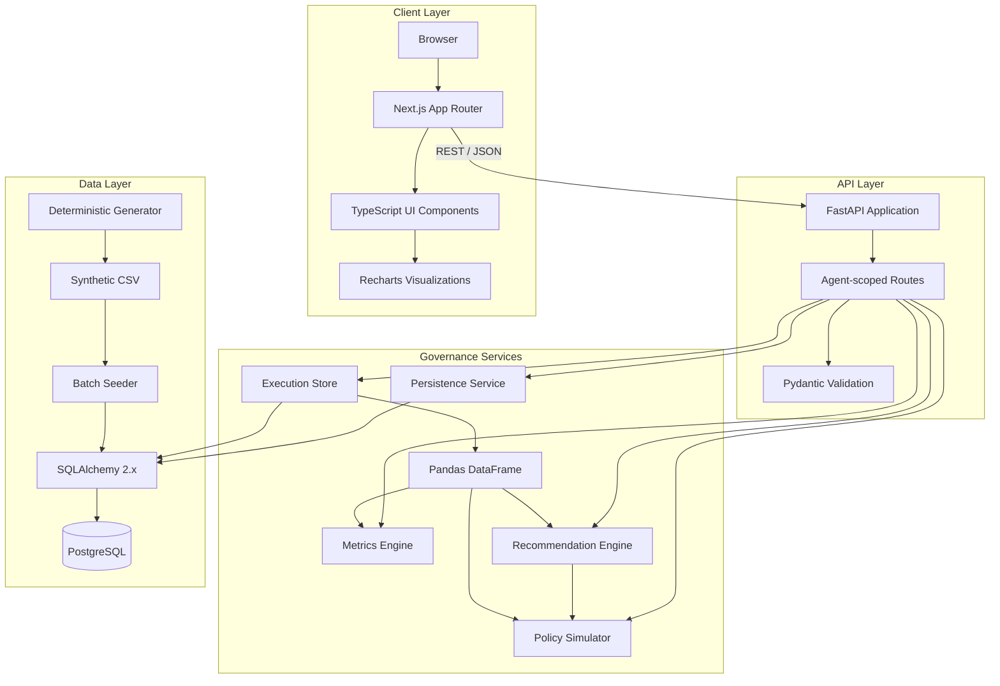
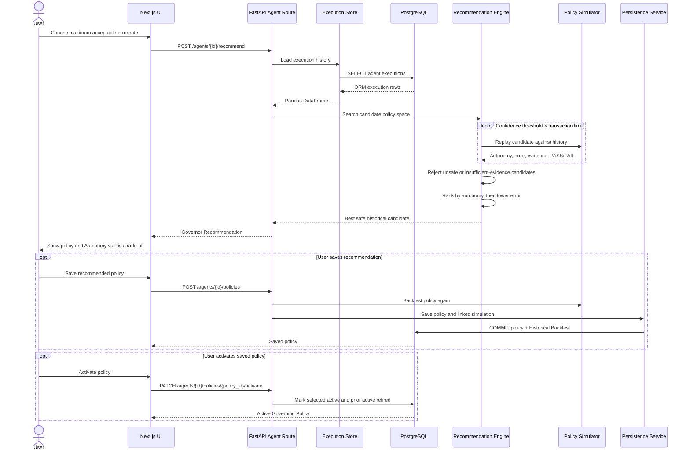
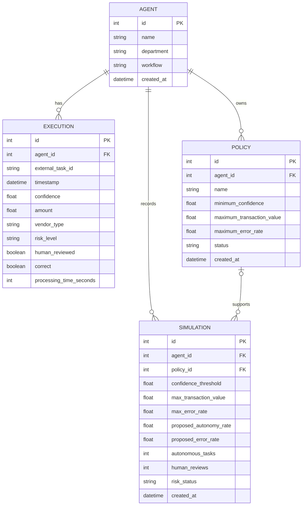
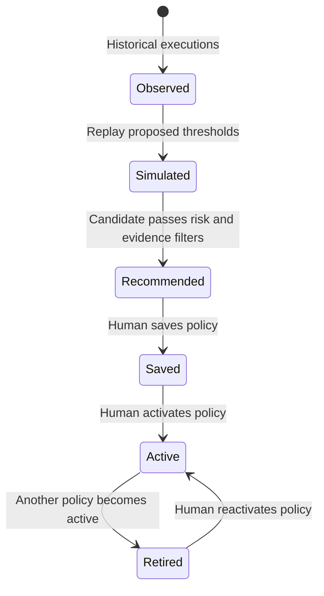

# System Architecture

## Overview

AI Autonomy Governor is a two-tier application backed by PostgreSQL. A Next.js frontend provides the Policy Simulator, Governor Recommendation, Autonomy vs Risk, policy lifecycle, and audit interfaces. FastAPI exposes agent-scoped REST endpoints and delegates deterministic governance calculations to Pandas-based services.

The central analytical boundary is deliberate:

```text
PostgreSQL → SQLAlchemy execution store → Pandas DataFrame → governance services
```

The recommendation engine does not train a model or infer future risk. It searches a fixed policy space and replays each candidate against observed execution outcomes.

## Component Architecture



### Frontend

- `frontend/app/` contains Next.js App Router pages for simulation, recommendations, and the Governance Audit Trail.
- `frontend/components/` contains the interactive simulator, recommendation workflow, policy activation UI, frontier visualization, and analytics components.
- `frontend/lib/api.ts` is the typed REST boundary. It reads `NEXT_PUBLIC_API_URL` and sends requests to the versioned FastAPI API.
- The shared sidebar loads available AI Employees and preserves selection through `?agentId=<id>`.

### FastAPI

- `backend/app/main.py` creates the application, configures local-development CORS for port 3000, and mounts system and agent routers below `/api/v1`.
- `backend/app/api/agents.py` validates AI Employee ownership, translates service errors into HTTP responses, and coordinates persistence.
- Pydantic schemas validate agent creation, simulation, recommendation, and policy-save inputs.

### Governance services

- **Execution Store** — loads one AI Employee's ordered ORM execution records and creates the DataFrame used by analytics.
- **Metrics Engine** — normalizes data, calculates overview metrics, and produces confidence, risk, vendor, and workflow breakdowns.
- **Policy Simulator** — compares current behavior with a proposed confidence/amount/risk policy and returns its historical impact and PASS/FAIL result.
- **Recommendation Engine** — searches candidate policies, removes unsafe or weak-evidence candidates, and ranks the remainder by autonomy and error.
- **Persistence Service** — converts analytical scalars to native values and atomically saves policies with their supporting Historical Backtest.

### Data pipeline

`scripts/generate_demo_data.py` deterministically creates 25,000 synthetic Accounts Payable executions with NumPy seed `42`. `scripts/seed_database.py` creates or reuses the demo AI Employee, replaces its execution records in one transaction, and inserts the CSV in batches.

## Policy Evaluation Flow



Generating a recommendation is read-only. Simulations are persisted when run through the simulation endpoint, and saving a policy persists a second supporting backtest linked by `policy_id`.

## Data Model



Important database behaviors:

- `(agent_id, external_task_id)` is unique for executions.
- Deleting an agent cascades to its executions, policies, and simulations.
- `Simulation.policy_id` is nullable. Deleting a policy sets the link to `NULL`, preserving simulation history.
- Agent, timestamp, confidence, risk, policy, and simulation foreign-key access paths are indexed by the schema.

## Request Flow

A typical metrics request follows this path:

1. A Next.js Server Component calls `getAgentMetrics(agentId)`.
2. The REST client sends `GET /api/v1/agents/{agent_id}/metrics` with caching disabled.
3. FastAPI verifies that the AI Employee exists.
4. The execution store queries PostgreSQL through SQLAlchemy and converts rows into a Pandas DataFrame.
5. The metrics service validates booleans, timestamps, and numeric ranges, then calculates overview and segment metrics.
6. Pandas and NumPy scalar values are converted to JSON-safe Python values.
7. FastAPI returns JSON to the Next.js page.

Simulation and recommendation requests share the same execution-loading path. Persistence is invoked only for simulation history, saved policies, and activation changes.

## Governance Lifecycle



`Observed`, `Simulated`, and `Recommended` are conceptual lifecycle stages. The `policies.status` column actually stores `saved`, `active`, or `retired`. Simulations separately store a `pass` or `fail` risk status. Recommendations are not automatically persisted.

The activation endpoint makes the selected policy active and changes any other active policy for the same AI Employee to retired within the same database transaction. This is an application-level invariant; the database does not currently enforce it with a partial unique index.

## Safety Model

In this project, “safe” has a narrow, testable meaning:

> A candidate policy's observed autonomous error rate on historical executions is less than or equal to the user-configured maximum error rate, and the candidate has enough historical autonomous examples.

The simulated autonomy predicate is:

```python
confidence >= confidence_threshold
and amount <= max_transaction_value
and risk_level != "high"
```

Default recommendation evidence requires at least 100 autonomous tasks. High-risk tasks cannot become autonomous through the current policy search.

This is governance by historical evidence, not formal verification. It does not prove future safety, detect distribution drift, enforce policies in an external execution gateway, or replace human accountability.
